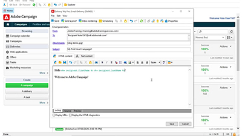
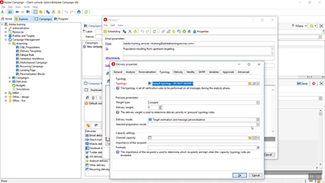
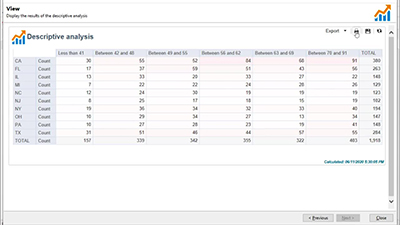
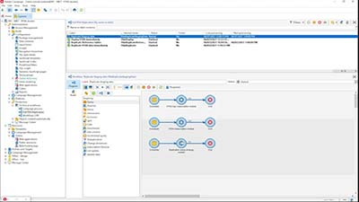

# Adobe Campaign v8 客户端控制台教程

Adobe Campaign 提供了跨渠道客户体验设计平台，支持可视化的营销活动编排、实时互动管理和跨渠道执行。 本用户指南包含了有关 Adobe Campaign V8 客户端控制台的众多特性和功能的视频和教程。

请参阅

>[!INFO]
> 您是否有疑问？ 您想与同行分享您的经验或交流想法吗？ 或者，您是否对 Adobe 团队的学习内容有任何反馈意见？ 在 [Adobe Campaign 学习社区的主题帖](https://experienceleaguecommunities.adobe.com:443/t5/adobe-campaign-classic/join-the-discussion-on-adobe-campaign-learning/td-p/419096)中加入对话！
> 
> 这些教程不是您要查找的内容？
> 请参阅 [Adobe Campaign Web 用户界面教程](https://experienceleague.adobe.com/docs/campaign-web-learn/tutorials/overview.html?lang=zh-Hans)，获取有关如何使用 Campaign Web 用户界面的指导。

>[!NOTE]
> 当前，Campaign v8 仅作为托管云服务提供，不能部署在内部部署或混合环境中。 从现有 Campaign Classic v7 环境进行自动迁移的功能尚不可用。
>
>请参阅[产品文档](https://experienceleague.adobe.com/docs/campaign/campaign-v8/new/v7-to-v8.html?lang=zh-Hans)，了解有关从 Classic v7 过渡到 V8 的更多信息。

## 员工精选

<table>
<tr>
  <td>
    
    

      <a href="/help/get-started/create-a-marketing-plan-programs-and-campaigns.md">
   <strong>创建营销计划</strong>
    </a>
    

    

    <em>了解如何创建营销计划、项目和营销活动。</em>
    

  </td>
   <td>
    
    

      <a href="./content-creation/create-and-design-email-deliveries.md">
    <strong>创建和设计电子邮件投放</strong>
    </a>
    

    

    <em>了解创建电子邮件投放的过程，并了解如何设计和个性化电子邮件内容。
</em>
    

  </td>
  <td>
    
    

      <a href="./send-messages/fatigue-management/typology-rules-for-fatigue-management.md">
    <strong>使用类型规则管理疲劳</strong>
    </a>
    

    

    <em>了解如何使用类型规则在 Adobe Campaign 中实施疲劳管理。</em>
    

  </td>
</tr>
<tr>
</td>
  <td>
    
    

      <a href="./reporting/generate-a-descriptive-analysis-report.md">
    <strong>生成描述性分析报告</strong>
    </a>
    

    

    <em>了解如何从工作流生成描述性分析报告。</em>
    

  </td>
  <td>
   
     

      <a href="./data-management/data-management-fundamentals.md">
    <strong>使用工作流进行数据管理的基础知识</strong>
    </a>
    

    

    <em>了解什么是目标维度和工作表，以及 Adobe Campaign 如何管理不同数据源的数据。</em>
    

  </td>
  <td>
   
     

      <a href="./data-management/api-staging-mechanism.md">
    <strong>使用 FFDA 的 API 暂存机制</strong>
    </a>
    

    

    <em>了解使用 Full FDA 的 API 暂存机制的工作原理。</em>
    

  </td>
</tr>
</table>

