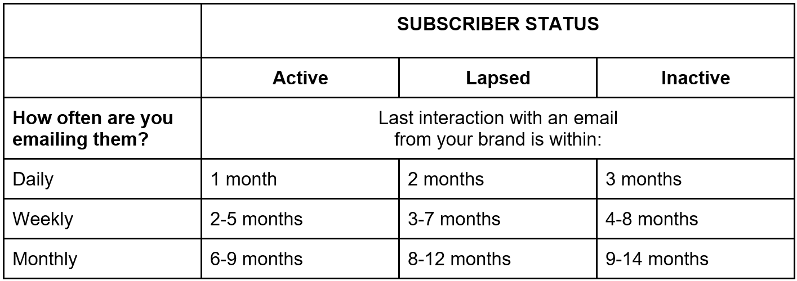

# 电子邮件投资回报率和订阅者重新参与的最佳实践

电子邮件营销是提高品牌忠诚度和增加销售额的有价值工具。 但是，由于人们每天收到的电子邮件数量巨大（更不用说他们正在消费的其他数字内容了），因此您的内容应该与众不同。 它必须满足受众的独特需求。

在本文中，我们将回顾四种策略，以提高订阅者参与度并全面成功地发起电子邮件促销活动。 我们还讨论了电子邮件疲劳、如何在受众中识别疲劳，并讨论了为改善订阅者体验可以采取的简单步骤。

## 什么是可投放性?

术语交付和投放能力之间可能存在混淆。 投放能力是衡量电子邮件促销活动成功与否的指标；是将垃圾邮件发送到订阅者的收件箱、垃圾邮件文件夹，还是被ISP阻止。 如果我们把它看成一个等式，那就是发送电子邮件的操作，登陆收件箱的功能，以及连续完成此操作的能力。

贵组织对电子邮件促销活动的投放能力进行跟踪的程度如何，您是否知道电子邮件的结束位置？

## 垃圾邮件过滤

在深入研究策略之前，务必要了解可能影响营销活动结果的最常见垃圾邮件过滤问题。 如果您继续向未打开电子邮件的不活跃订阅者发送电子邮件，则在超过一年的时间内，您可能会遇到以下问题：

* 阻止列表和允许列表
* 内容过滤器
* IP和域信誉
* 身份验证
* 投诉
* 用户操作

## 最大限度地提高电子邮件投资回报

你知道在网上一分钟内，有超过一百万次的视频浏览，两百万次Google搜索查询，六百万次Facebook浏览，以及两亿封电子邮件吗？ 在发生如此多的情况下，务必确保您的内容不会在噪音中丢失。 特别是如果您是在假日季节创建活动，那么在潜在客户和回访客户面前发送电子邮件就更具挑战性。

从11月到1月初，发送的营销电子邮件数量显着增加。 邮箱提供商(ISP)的服务器流量将比今年剩余时间要多得多，因此，将更加警惕地保护其客户（您的订阅者）。

以下是四项关键策略，可最大限度地提高您的ROI:

### 1.准备内容日历

* ISP会跟踪您从IP地址发送的平均信息，因此请尽可能多地分发该卷，以避免创建红标并发送到垃圾邮件
* 提前设置内容日历，并为内容作者做好准备，以增加发送量
* 请考虑您如何计划电子邮件发送时间并避免发送量出现巨大激增。 请考虑一些策略，例如：
   * 不是同时发送爆炸，而是在几天内发送
   * 在人们收到电子邮件过载（如上午8点到10点）的一天中的某个时间进行策略性规划
   * 如果不能将它分散到几天，请尝试几个小时

### 2.基础设施

* 通过使用您自己的电子邮件进行测试，确保正确设置电子邮件身份验证
* 熟悉跳出处理，并检查ISP的性能
   * 特定ISP是否存在任何潜在问题或块？
   * 在开始发送大量内容之前，先了解您的问题，以避免令人不快的意外和营销活动性能不佳

### 3.数据

* 识别所有客户获取技术，特别是您的注册流程和GDPR。
* 当您询问订阅者的电子邮件地址时，请尽可能保持透明：
   * 您将发送哪些内容（新闻稿、促销活动、事件）
   * 您将发送多少封电子邮件（每日、每周、每月）

* 向新订阅者发送欢迎电子邮件：
   * 欢迎电子邮件有助于确保订阅者不会被新内容蒙住眼睛，并且不会取消订阅或标记为垃圾邮件。
   * 欢迎电子邮件也是表现的良好指标。 如果没有成功交付或与他们进行交互，您会知道这是性能不佳或数据收集不力的征兆。

### 4.电子邮件管理

* 对订阅者进行细分并监控他们在品牌生命周期中的位置
* 使用内容个性化策略提高电子邮件的相关性

## 如何提高电子邮件参与度并解决电子邮件疲劳问题

当订阅者厌倦了接收电子邮件时，会发生电子邮件疲劳。 由于多种原因，可能会发生电子邮件疲劳；他们可能在您的列表上停留了太久，已经厌倦了听到您的消息，或者您的最新内容不再相关。 您和您的团队应该确定哪些客户感到电子邮件疲劳以及原因。 那么，要注意什么标志呢？

要监控的关键量度包括：

* 较低的开放率
* 降低点击率
* 更高的退订率

遗憾的是，大多数感到电子邮件疲劳的订阅者并不会因此而轻松。 他们不会取消订阅自己，这是他们对内容不满意的明确标记。 许多用户只需删除或忽略您的电子邮件，因此您可能仍会看到未参与的订阅者打开的次数。 底线是，如果您对订阅者改变习惯的行为不做出反应，可能会损害发件人的声誉，这最终会损害您的整体成功。

考虑到这一点，下面是一些最佳实践，可让您的订阅者保持参与度，并预测他们希望接收的内容类型，以避免取消订阅和不活动的受众。

### 1.创建电子邮件频度策略

遗憾的是，对于每周要发送的电子邮件数量，没有正确的答案。 要找到正确的数字，请考虑以下因素：

* 客户生命周期中的客户位于何处？
* 他们对您的电子邮件的参与度如何？
   * 购物篮放弃电子邮件与新闻稿
   * 重新激活电子邮件与销售发布
   * 购物篮放弃电子邮件与新产品发布
* 客户从品牌接收内容的能力是多少？
* 客户的季节性偏好是什么？

### 2.确定订阅者的状态

订阅者的状态（活动、失效或不活动）取决于您向他们发送内容的频率。 从此处，您可以确定他们的参与度。

下面是一个简单的表格，可帮助您在审核过程中：

例如，如果您每天向客户发送电子邮件，则他们应在上个月内与其中一封电子邮件进行交互，以被视为活动和参与。 相反，如果您按月向客户发送电子邮件，并且他们在9-14个月内未进行交互，则可能会认为他们不活跃。

对于已失效和不活动的用户，请考虑查看用户订阅日期，以帮助确定其参与程度。 例如，他们是否在竞争或其他营销活动的日期订阅了？ 他们是否在网站弹出窗口中注册了折扣优惠？ 确定已失业和不活跃的用户后，请务必更改您的策略，以努力提高用户的满意度，并将他们重新变为活跃的订阅者。

### 3.实施重新参与战略

将此过程划分为两个重点领域：a)电子邮件发送模式和b)电子邮件本身的创意内容。 下面将更详细地查看以下每个区域：

**更新发送模式和计划**

* **慢慢开始** 是马拉松，不是冲刺。 它不是您一天内可以实施的解决方案。 请考虑从一小部分受众（大约4%到5%）开始，并仔细监控性能。

* **考虑品牌声誉**  — 确保不活动区段的电子邮件流量不会导致任何声誉问题。

* **自动化工作流**  — 保持清洁清洁。

* **压力规则**  — 将重新参与计划的订阅者排除在接收任何其他电子邮件之外。

**创意和内容**

* **提供明确的选择加入/选择退出**  — 让用户能够轻松地快速决定是否希望收到您的来信。 您可能会因为首先满足客户需求而选择加入而获得回报，而不是专注于客户参与的业务需求。

* **创建首选项中心**  — 这是为订阅者提供额外控制的机会，允许他们从不同的电子邮件内容（如新闻稿、促销优惠、活动等）中进行选择，并且按不同的规律进行选择。 请记住，如果您确实决定提供此选件，请确保您能够按照相关说明进行操作，并正确划分受众以符合这些偏好。

* **强主题行**  — 确保它们与其他品牌内容独树一帜

* **测试和学习**  — 一个良好的测试计划对于确保您的工作达到预期效果非常重要。 了解哪些内容有效哪些内容无效并进行相应迭代。

有关本文的回顾和实施重新参与策略的实时演示，请观看我们的 [网络研讨会](https://adobecustomersuccess.adobeconnect.com/pm8goho13xuy/).

在 [客户成功](https://experienceleague.adobe.com/docs/customer-success/customer-success/overview.html) 中心。
